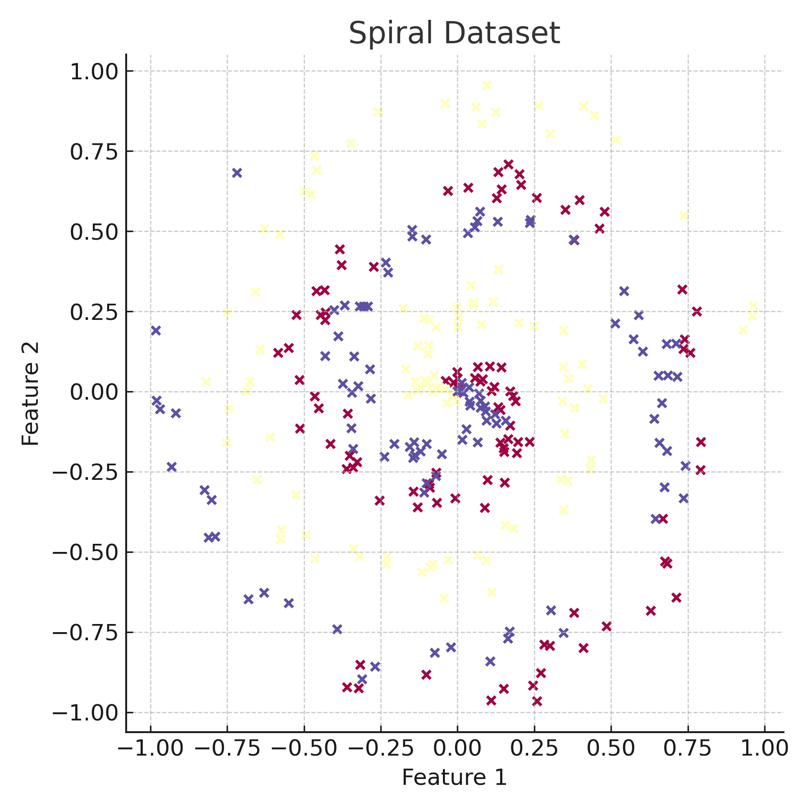

# Neural Network From Scratch 🧠

This project implements a complete neural network from the ground up using only Python and NumPy—without any machine learning libraries. Inspired by the book *"Neural Networks from Scratch"* by Harrison Kinsley & Daniel Kukieła, it walks through the foundational concepts behind deep learning by building all major components manually.

## 📁 Structure

Each Python file (`p1-*.py`) corresponds to a conceptual step:

- `p1` to `p4`: Layers, dot products, batches, and OOP design
- `p5` to `p8`: ReLU, Softmax, loss functions, and basic training loop
- `p9` to `p13`: Optimizers (SGD, Momentum, Adagrad, RMSProp, Adam), regularization, and dropout
- `create_data.py`: Spiral, vertical, and sine data generation

## Features Implemented

- Dense Layers
- ReLU & Softmax Activation Functions
- Categorical Cross-Entropy Loss
- Forward & Backward Propagation
- Manual Gradient Descent
- Advanced Optimizers: SGD, Momentum, RMSProp, Adam
- Regularization & Dropout
- Modular and extensible OOP structure

## Spiral Dataset



## Requirements

- Python 3.7+
- NumPy

Install dependencies with:
```bash
pip install -r requirements.txt
```

## Learn More

This project is educational and ideal for understanding how frameworks like TensorFlow or PyTorch work under the hood. Every component—from the forward pass to gradient updates—is hand-coded and well-commented for easy learning.

|Inspired by: Neural Networks from Scratch Book
